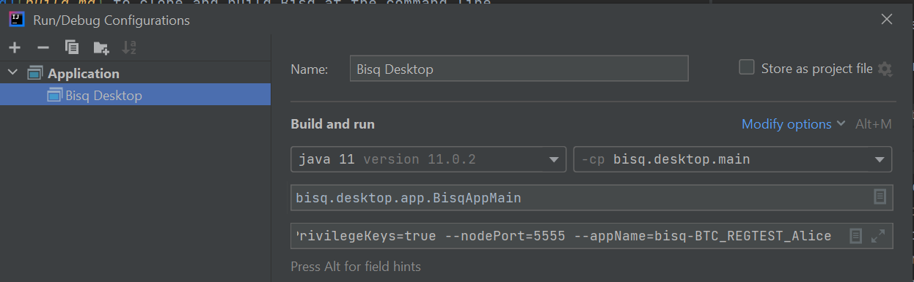

# Importing Bisq into IntelliJ IDEA

Most Bisq contributors use IDEA for development. The following instructions have been tested on IDEA 2021.3.

1. Follow instructions in [build.md](build.md) to clone and build Bisq at the command line
1. Open IDEA
1. If you are inside a loaded Project, go to `File -> Settings -> Build, Execution, Deployment -> Compiler -> Annotation Processors`, else go to `Customize -> All settings... -> Build, Execution, Deployment -> Compiler -> Annotation Processors`, and check the `Enable annotation processing` to enable processing of Lombok annotations (Lombok plugin installed by default since v2020.3)
1. Go to `File -> New -> Project from Existing Sources...` (or `Projects -> Open` from welcome screen) and select the main Bisq folder to automatically load the related Gradle project
1. If you did not yet setup JDK11 in IntelliJ, go to `File -> Project Structure -> Project` and set `SDK` to your JDK11 folder
1. Select JDK11 for Gradle as well: go to `File -> Settings -> Build, Execution, Deployment -> Build Tools -> Gradle` and select the JDK11 location in `Gradle JVM` field
1. Run `Build -> Build Project`, the process should complete correctly
1. Go to `Run > Edit Configurations... -> Plus (+) icon on the top left -> Application` and fill the requested fields as shown below, where `CLI arguments` should be taken from those listed in [dev-setup.md](dev-setup.md) (_Alice_ instance in the example):

9. You should now be able to run Bisq by clicking on the _Play_ button or via `Run -> Run 'Bisq Desktop'`
10. Use `Run -> Debug 'Bisq Desktop'` to debug the application and execute breakpoints

> TIP: If you encounter compilation errors in IDEA related to the `protobuf.*` classes, it probably is because you didn't build Bisq at the command line as instructed above. You need to run the `generateProto` task in the `other` project. You can do this via the Gradle tool window in IDEA, or you can do it the command line with `./gradlew :other:generateProto`. After this, run `Build -> Build Project` again, and verify it completes successfully.
>
> If this does not solve the issue, try to execute `./gradlew clean` and then rebuild the project again.
